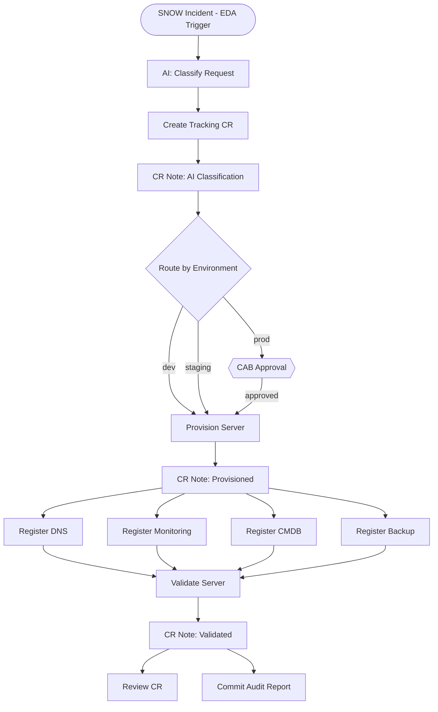

# AO Overview Demo — Server Onboarding

A live demo that walks a customer through Automation Orchestrator. Two parts:

1. **Working workflow** — pre-imported, fires from a real ServiceNow incident via EDA, runs end-to-end with SNOW work notes updating at every milestone
2. **Live build** — build a workflow from scratch on the AO canvas to show how it's done

The narrative is **Server Onboarding** — a new server request arrives in ServiceNow, AO orchestrates the full Day 1 readiness process. No real VMs are provisioned — the stubs simulate the actions so the workflow structure and AO features are the star.

## What the Demo Shows

| Feature | Aria Equivalent | How It's Shown |
|---------|----------------|----------------|
| Visual canvas | Schema editor | Build the workflow live |
| AAP job template nodes | JavaScript actions | Each step calls a real AAP job template |
| Agentic nodes (AI) | No equivalent | AI reads the SNOW request, classifies the server |
| Switch/condition | Decision elements | Route by environment: dev → auto, prod → approval |
| Approval gate | User interaction | Production path pauses for CAB approval |
| Parallel execution | forEach loops | DNS, monitoring, CMDB, backup run in parallel |
| Convergence | forEach completion | All registrations must complete before validation |
| EDA trigger | Event broker | ServiceNow incident polling triggers the workflow |
| ServiceNow audit trail | Aria audit | Every milestone writes work notes to the CR |
| Git integration | Packages/Git sync | Audit report committed to GitHub |
| set_stats artifact passing | Variable binding | Each node publishes data the next node consumes |

## Workflow



**16 nodes** in the working copy (the live build can skip the CR note nodes to keep it to ~13).

## How to Trigger

Create a ServiceNow incident with a short description starting with **"Server Onboarding"**:

> Server Onboarding: webserver-prod-01, RHEL 9, production environment. Needs DNS, monitoring, CMDB, and backup.

EDA picks it up, fires the AO workflow, and work notes build up in the tracking CR as each step completes.

## Setup

### 1. Clone and configure

```bash
git clone https://github.com/crenwick93/ao-overview-demo.git
cd ao-overview-demo
cp .env.example .env
# Fill in .env with your credentials
```

### 2. Build the Decision Environment

```bash
./dependencies/build-images.sh --push
```

### 3. Install collections and apply CaC

```bash
ansible-galaxy collection install -r ansible_deployment/cac/requirements.yml
./ansible_deployment/scripts/cac-apply.sh
```

This creates all AAP job templates, credentials, EDA rulebook activation, and the project.

### 4. Import and publish the working workflow

Import `ao/server-onboarding.json` in the AO UI. Configure the agentic node model/credentials. Publish.

### 5. Update .env with AO webhook creds and re-run CaC

After publishing, AO provides webhook credentials. Add them to `.env` and re-run:

```bash
./ansible_deployment/scripts/cac-apply.sh
```

### 6. Test

Create a ServiceNow incident with "Server Onboarding" in the short description, or:

```bash
./scripts/test-trigger.sh
```

## Project Structure

```
├── .env.example                             ← Credential template
├── DEMO_SCRIPT.md                           ← Talk track and live-build guide
├── ao/
│   └── server-onboarding.json               ← Working workflow (import into AO)
├── playbooks/
│   ├── trigger_ao_workflow.yml               ← EDA-to-AO bridge
│   ├── manage_snow_incident.yml              ← Incident lifecycle
│   ├── manage_snow_change_request.yml        ← CR lifecycle
│   ├── bridge_ao_approval.yml                ← SNOW→AO approval bridge
│   ├── manage_git_repo.yml                   ← Git commits
│   ├── simulate_provision.yml                ← Stub: server provisioning
│   ├── register_service.yml                  ← Stub: DNS/monitoring/CMDB/backup
│   ├── validate_server.yml                   ← Stub: post-provision checks
│   └── generate_report.yml                   ← Stub: markdown report
├── rulebooks/
│   └── server_onboarding.yml                 ← EDA: polls SNOW for new requests + CR approvals
├── dependencies/
│   └── de/decision-environment.yml           ← ServiceNow Decision Environment
├── ansible_deployment/cac/
│   ├── apply.yml                             ← CaC playbook
│   ├── vars.yml                              ← AAP + EDA object definitions
│   └── requirements.yml                      ← Collection dependencies
└── scripts/
    ├── test-trigger.sh                       ← Manual workflow trigger
    └── test-ao-approval-api.py               ← AO approval API debug tool
```

## Credentials Required

| Credential | Purpose | When Needed |
|------------|---------|-------------|
| AAP OAuth Token | CaC deployment | Before CaC |
| ServiceNow credentials | CR management + EDA polling | Before CaC |
| GitHub PAT | Audit report commits | Before CaC |
| AO Webhook credentials | EDA-to-AO bridge | After publishing workflow |
| AO Service Account | CR approval bridge | After publishing workflow |
| DE image | EDA Decision Environment | Before CaC |
