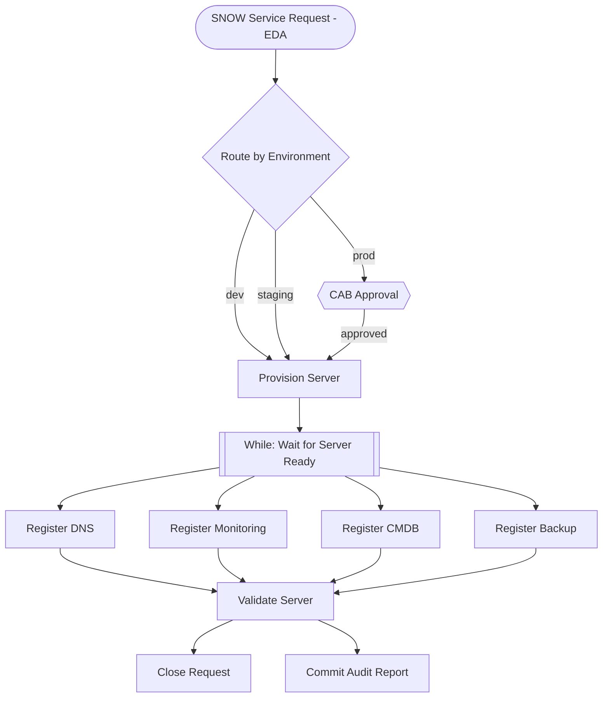

# AO Overview Demo — Server Onboarding

A live demo that walks a customer through Automation Orchestrator. Two parts:

1. **Working workflow** — pre-imported, fires from a real ServiceNow service request via EDA, runs end-to-end with work notes updating on the RITM at every milestone
2. **Live build** — build the same workflow from scratch on the AO canvas to show how it's done

The narrative is **Server Onboarding** — a new VM request arrives in ServiceNow, AO orchestrates provisioning of a real EC2 instance, waits for the server to become reachable (While loop), runs parallel service registrations, validates, and closes the request.

## What the Demo Shows

| Feature | Aria Equivalent | How It's Shown |
|---------|----------------|----------------|
| Visual canvas | Schema editor | Build the workflow live |
| AAP job template nodes | JavaScript actions | Each step calls a real AAP job template |
| Switch/condition | Decision elements | Route by environment: dev → auto, prod → approval |
| Approval gate | User interaction | Production path pauses for CAB approval |
| **While loop** | Wait/retry logic | Poll until the EC2 instance is SSH-reachable |
| Parallel execution | forEach loops | DNS, monitoring, CMDB, backup run in parallel |
| Convergence | forEach completion | All registrations must complete before validation |
| EDA trigger | Event broker | ServiceNow request polling triggers the workflow |
| ServiceNow audit trail | Aria audit | Every milestone writes work notes to the RITM |
| Git integration | Packages/Git sync | Audit report committed to GitHub |
| set_stats artifact passing | Variable binding | Each node publishes data the next node consumes |

## Workflow



**11 nodes** — Provision spins up a real EC2 instance, the While loop polls SSH port 22 until reachable, then parallel registrations fan out. Every step updates work notes on the RITM inside the playbook.

## How to Trigger

Create a ServiceNow **service request item** (RITM) with a short description starting with **"Server Onboarding"**:

> Server Onboarding: db-prod-01

EDA polls `sc_req_item`, picks it up, and fires the AO workflow. Work notes build up on the RITM as each step completes, and the request is closed automatically at the end.

## Setup

### 1. Clone and configure

```bash
git clone https://github.com/crenwick93/ao-overview-demo.git
cd ao-overview-demo
cp .env.example .env
# Fill in .env with your credentials
```

### 2. Install collections and apply CaC

```bash
ansible-galaxy collection install -r ansible_deployment/cac/requirements.yml
./ansible_deployment/scripts/cac-apply.sh
```

This creates all AAP job templates, credentials, EDA rulebook activation, and the project. The DE image is `quay.io/crenwick93/snow-de:latest` (hardcoded in CaC).

### 3. Import and publish the working workflow

Import `ao/server-onboarding.json` in the AO UI. Publish.

### 4. Update .env with AO webhook creds and re-run CaC

After publishing, AO provides webhook credentials. Add them to `.env` and re-run:

```bash
./ansible_deployment/scripts/cac-apply.sh
```

### 5. Test

Create a ServiceNow RITM with "Server Onboarding" in the short description, or:

```bash
./scripts/test-trigger.sh
```

### 6. Cleanup after demo

Terminate any EC2 instances left over:

```bash
ansible-playbook playbooks/terminate_demo_instances.yml
```

This terminates all instances tagged `managed_by: ao-overview-demo`.

## Project Structure

```
├── .env.example                             ← Credential template
├── DEMO_SCRIPT.md                           ← Talk track and live-build guide
├── ao/
│   └── server-onboarding.json               ← Working workflow (import into AO)
├── playbooks/
│   ├── trigger_ao_workflow.yml               ← EDA-to-AO bridge
│   ├── manage_snow_request.yml               ← RITM work notes + close
│   ├── manage_git_repo.yml                   ← Git commits
│   ├── provision_server.yml                  ← EC2 provisioning (real)
│   ├── check_server_ready.yml                ← SSH readiness check (While loop)
│   ├── terminate_demo_instances.yml          ← Post-demo cleanup
│   ├── register_service.yml                  ← Stub: DNS/monitoring/CMDB/backup
│   ├── validate_server.yml                   ← Stub: post-provision checks
├── rulebooks/
│   └── server_onboarding.yml                 ← EDA: polls SNOW for new RITMs
├── dependencies/
│   └── de/decision-environment.yml           ← ServiceNow Decision Environment
├── ansible_deployment/cac/
│   ├── apply.yml                             ← CaC playbook
│   ├── vars.yml                              ← AAP + EDA object definitions
│   └── requirements.yml                      ← Collection dependencies
└── scripts/
    ├── test-trigger.sh                       ← Manual workflow trigger
    └── test-ao-approval-api.py               ← AO approval API debug tool
```

## Credentials Required

| Credential | Purpose | When Needed |
|------------|---------|-------------|
| AAP OAuth Token | CaC deployment | Before CaC |
| ServiceNow credentials | RITM work notes + EDA polling | Before CaC |
| GitHub PAT | Audit report commits | Before CaC |
| AWS credentials | EC2 provisioning | Before CaC |
| AO Webhook credentials | EDA-to-AO bridge | After publishing workflow |
